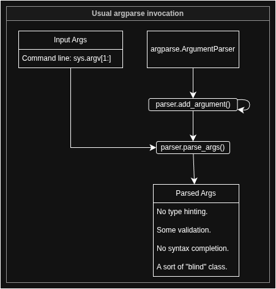
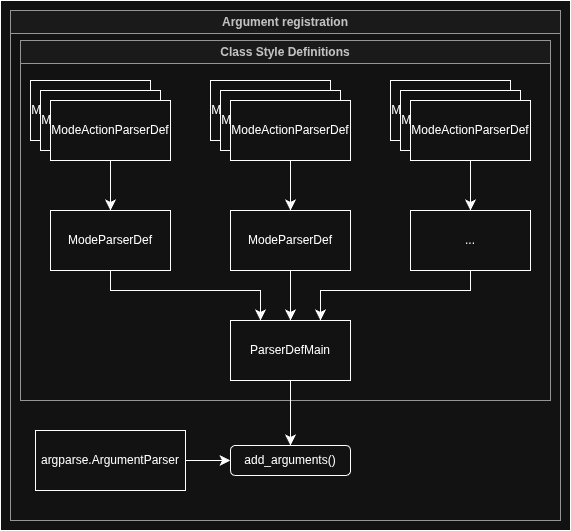

# Arg-Parse

Simplifies `argparse` arg handling. Specifically in the case of nested parsers (sub-parsers) two levels deep.

```
python3 . mode_1 action_1 {action_args}
```

This allows simple class style grouping of args in code. `argparse` can become difficult to read from a certain size of application onwards.

Also allows for enum style value based validations, syntax completion of resulting arg class, and easy value inheritance from file and env vars.

Overall. It's designed to simplify total arg passing to your app.

## Usual argparse invocation.

The usual argparse invocation goes alone the lines of input arguments feed into a parser that has some basic validation rules (types/choices) applied. For smaller applications this is great. For larger applications (especially including subparsers and mutually exclusive groups) this quickly becomes difficult to read and maintain.

Further, the resulting parsed args object is implicit. No syntax completion. No type hinting. No logical validation. It's a class we sort of trust blindly. And sometimes that's all we need. Simplicity does tend to reign supreme.



## Organising arguments into class style definitions

This project organises argument specification into a class style in a mode/action pattern. The app is to perform certain actions. And these actions are grouped by a certain mode. One example would be `docker container run {args}`. Actual available usage might be more flexible than that, but that's the main use-case.

Arguments are defined on a class level. Still using an `argparser.Argumentparser` but defining a certain structure overhead. Resulting in a native organisation of flags and code in general.



[//]: # (![Alt text]&#40;images/arg-parse.drawio.png&#41;)

Invocation example (see `_samples/_01/run.py`):
```
# Usual argparse parser.
base_parser = argparse.ArgumentParser(
    prog="arg-parse",
    description="Sample code.")

# Defining flags via classes and registering with argparse parser.
parser_def = ParserDefMain()
parser_def.register_sub_parser(ParserDefMode1())
parser_def.register_sub_parser(ParserDefMode2())
parser_def.register_args(base_parser)
```

Where each of `ParserMode1` and `ParserMode2` are sub parsers defined as e.g.:
```
from arg_parse._samples._01.enums import ModeType, MetaType
from arg_parse._samples._01.parsers.mode_1.parser_mode_1_action_1 import ParserMode1Action1
from arg_parse._samples._01.parsers.mode_1.parser_mode_1_action_2 import ParserMode1Action2
from arg_parse.ifaces import IParser


class ParserMode1(IParser):

    def add_args(self, parent_parser):

        sub_parsers = [
            ParserMode1Action1(),
            ParserMode1Action2()
        ]

        parser = parent_parser.add_parser(
            description="Mode 1.",
            name=ModeType.MODE_1,
            help="Mode 1 help.")

        action_parsers = parser.add_subparsers(
            dest=MetaType.ACTION,
            help="Action to take.",
            required=True)

        for sub_parser in sub_parsers:
            sub_parser.add_args(action_parsers)

        return parser
```

And `ParserMode1Action1` defined as:

```
from arg_parse._samples._01.enums import Mode1ActionType
from arg_parse.ifaces import IParser


class ParserMode1Action1(IParser):

    def add_args(self, parent_parser):

        parser = parent_parser.add_parser(
            description="Mode 1 action 1.",
            name=Mode1ActionType.ACTION_1)

        parser.add_argument(
            "--required-arg", "-r",
            help="A required arg for mode 1 action 1.",
            required=True)

        return parser
```

See `arg_parse/_samples/_01` for details. Run via `make run-sample`.

## From env/file and custom args classes

Argparse supports inline defaults. But doesn't support sourcing configuration from file or env. `arg_parse` does. Commandline arguments are applied. We define some args class. With some fields we expect to be available as flags. If an arg file is specified. That's where we'll look for our initial invocation arg values. For a given mode/action pair. Then we'll look at our local environment based on prefix.

Finally, we apply any passed input flags and apply them last. The priority then is file < env < command line.

In code this looks like this:

```
# Need to explicitly import enums to have them accessible for validation.
from arg_parse._samples._01.enums import *
from arg_parse.ifaces import Args


class AppArgs(Args):
    def __init__(self):
        super().__init__(globals())
        self.required_arg = RequiredArg.VALUE_1
        self.optional_int_arg = 123


arg_parser = ArgParser(
    args_cls=AppArgs,
    from_file_path=get_args_path(),
    from_env_prefix=get_env_var_prefix())

parsed_args = arg_parser.parse_args(base_parser, *args)
parsed_args.log()
```
`parsed_args` now is a validated instance of an `Args` class with syntax completion and enum based validation rules. And can be fed from file, env, and command-line input.

## Enum based validations

Enum based validations are somewhat sanity inducing validation rules for attributes on an `Args` class (e.g. `AppArgs` above). They must be imported in whichever context the `AppArgs` class is defined to feed into `globals()`. After a value is set against an `Args` class the instance is validated and we look for any matching enum classes by name (e.g. `attribute_name` -> `AttributeName` as a class name).

If such a class is found. We validate against the class's validation method. See `_samples/_01/enums` for details. This enhances our ability to trust our configuration. And we can reasonably expect to use the enums against it in validation.

Validation rules may be value specific (default) or custom overrides:
```
class OptionalIntArg(IEnum):
    @classmethod
    def valid(cls, value):
        return isinstance(value, int)
```

# Other
## Make docs
There's a handy `make_docs()` method available, too. Use as:
```
from arg_parse.make_docs import make_docs


# Once args were added using ParserMain (see _samples/_01):
make_docs(arg_parser)
```
Yields output:
```
Sample code.
================================================================================
arg-parse mode_1    : Mode 1.
================================================================================
 .
  + action_1        : Mode 1 action 1.
   .
   *  --required-arg, -r
   .      Help    : Required. A required arg for mode 1 action 1.
   .      Type    : str
   
  + action_2        : Mode 1 action 2.
   .
   *  --required-arg, -r
   .      Help    : Required. A required arg for mode 1 action 2.
   .      Type    : str
   
================================================================================
arg-parse mode_2    : Mode 2.
================================================================================
 .
  + action_1        : Mode 2 action 1.
   .
   *  --required-arg, -r
   .      Help    : Required. A required arg for mode 2 action 1.
   .      Type    : str
   
  + action_2        : Mode 2 action 2.
   .
   *  --required-arg, -r
   .      Help    : Required. A required arg for mode 2 action 2.
   .      Type    : str
```