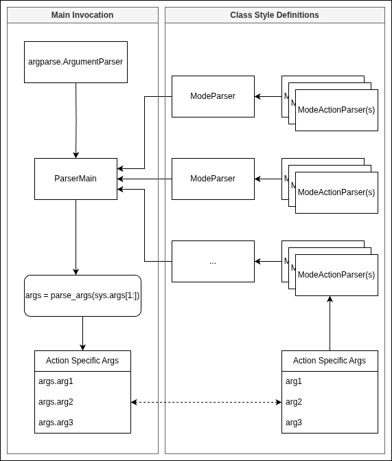

# Arg-Parse

Simplifies `argparse` arg handling. Specifically in the case of nested parsers (sub-parsers) two levels deep.

```
python3 . mode_1 action_1 {action_args}
```

This allows simple class style grouping of args in code. `argparse` can become difficult to read from a certain size of application onwards.



Invoke as (see `_samples/_01/run.py`):
```
import argparse
import sys

from arg_parse._samples._01.parsers.mode_1.parser_mode_1 import ParserMode1
from arg_parse._samples._01.parsers.mode_2.parser_mode_2 import ParserMode2
from arg_parse.make_docs import make_docs
from arg_parse.parser_main import ParserMain

if __name__ == '__main__':
    args = sys.argv[1:]
    arg_parser = argparse.ArgumentParser(
        prog="arg-parse",
        description="Sample code.")
    parser = ParserMain(arg_parser, [
        ParserMode1(),
        ParserMode2()])
    parsed_args = parser.parse_args(*args)

    make_docs(arg_parser)
    print(parsed_args.__dict__)
```

Where each of `ParserMode1` and `ParserMode2` are sub parsers defined as e.g.:
```
from arg_parse._samples._01.enums import ModeType, MetaType
from arg_parse._samples._01.parsers.mode_1.parser_mode_1_action_1 import ParserMode1Action1
from arg_parse._samples._01.parsers.mode_1.parser_mode_1_action_2 import ParserMode1Action2
from arg_parse.ifaces import IParser


class ParserMode1(IParser):

    def add_args(self, parent_parser):

        sub_parsers = [
            ParserMode1Action1(),
            ParserMode1Action2()
        ]

        parser = parent_parser.add_parser(
            description="Mode 1.",
            name=ModeType.MODE_1,
            help="Mode 1 help.")

        action_parsers = parser.add_subparsers(
            dest=MetaType.ACTION,
            help="Action to take.",
            required=True)

        for sub_parser in sub_parsers:
            sub_parser.add_args(action_parsers)

        return parser
```

And `ParserMode1Action1` defined as:

```
from arg_parse._samples._01.enums import Mode1ActionType
from arg_parse.ifaces import IParser


class ParserMode1Action1(IParser):

    def add_args(self, parent_parser):

        parser = parent_parser.add_parser(
            description="Mode 1 action 1.",
            name=Mode1ActionType.ACTION_1)

        parser.add_argument(
            "--required-arg", "-r",
            help="A required arg for mode 1 action 1.",
            required=True)

        return parser
```

See `arg_parse/_samples/_01` for details. Run via `make run-sample`.

There's a handy `make_docs()` method available, too. Use as:
```
from arg_parse.make_docs import make_docs


# Once args were added using ParserMain (see _samples/_01):
make_docs(arg_parser)
```
Yields output:
```
Sample code.
================================================================================
arg-parse mode_1    : Mode 1.
================================================================================
 .
  + action_1        : Mode 1 action 1.
   .
   *  --required-arg, -r
   .      Help    : Required. A required arg for mode 1 action 1.
   .      Type    : str
   
  + action_2        : Mode 1 action 2.
   .
   *  --required-arg, -r
   .      Help    : Required. A required arg for mode 1 action 2.
   .      Type    : str
   
================================================================================
arg-parse mode_2    : Mode 2.
================================================================================
 .
  + action_1        : Mode 2 action 1.
   .
   *  --required-arg, -r
   .      Help    : Required. A required arg for mode 2 action 1.
   .      Type    : str
   
  + action_2        : Mode 2 action 2.
   .
   *  --required-arg, -r
   .      Help    : Required. A required arg for mode 2 action 2.
   .      Type    : str
```